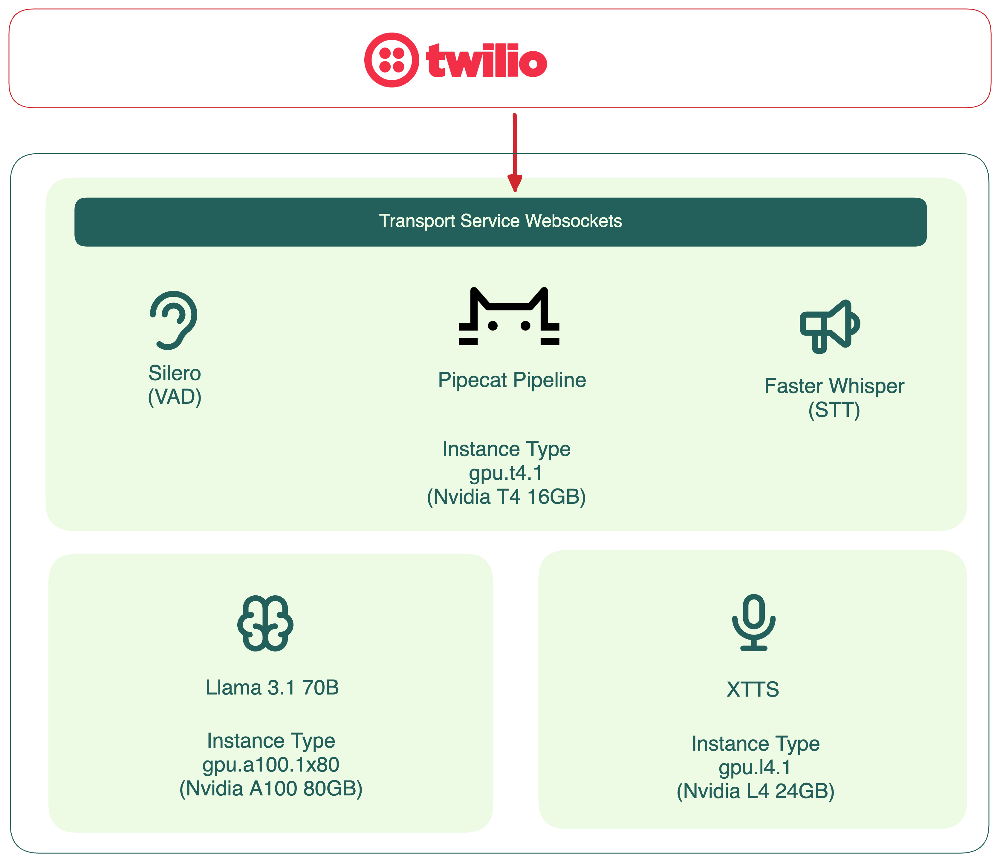
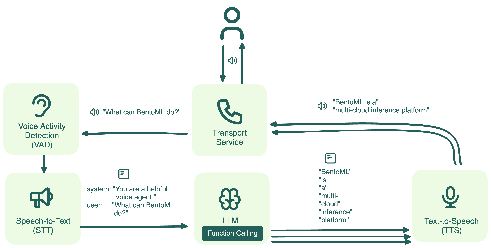
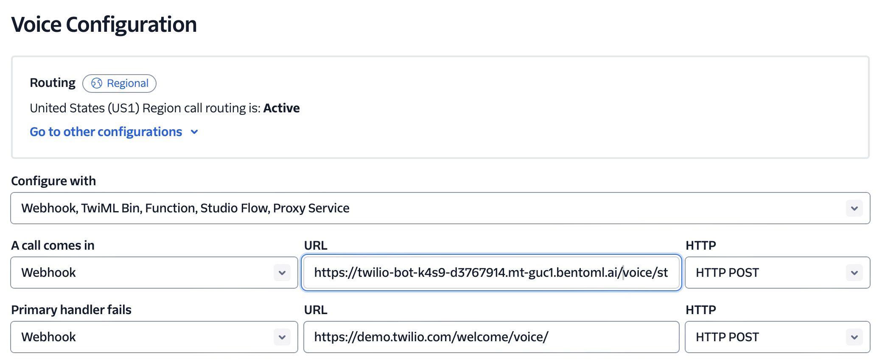

# Voice Agent with Open Source Models

This repository demonstrates how to build a voice agent using open-source Large Language Models (LLMs), text-to-speech (TTS), and speech-to-text (STT) models. It utilizes [Pipecat](https://github.com/pipecat-ai/pipecat) voice pipeline and is deployed with [BentoML](https://github.com/bentoml/BentoML). The voice agent is accessible via a phone number, leveraging Twilio as the communication transport. This example can be easily extended to incorporate additional voice agent features and functionality.



This voice agent the following models:

- Llama 3.1
- XTTS text-to-speech model
- Whisper speech-to-text model

The LLM and XTTS models are deployed as separate API endpoints, as outlined in the instructions below. These API endpoints are provided to the voice agent through environment variables.

See [here](https://docs.bentoml.com/en/latest/examples/overview.html) for a full list of BentoML example projects.

## Prerequisites

This repository has been verified with Python 3.11 and BentoML 1.3.9.

```
pip install -U bentoml
```

## Dependent models

Deploy the LLM and XTTS models by following the instructions provided in their respective repositories.

- Deploy LLM with [BentoVLLM](https://github.com/bentoml/BentoVLLM/tree/main/llama3.1-70b-instruct-awq)
- Deploy XTTS with [BentoXTTSStreaming](https://github.com/bentoml/BentoXTTSStreaming)



Once the models are deployed, you can obtain their API endpoints from BentoCloud. These endpoints should then be set as environment variables for the voice agent deployment.

- XTTS_SERVICE_URL
- OPENAI_SERVICE_URL

## Run the voice agent

Install the following system packages to run the voice agent locally.

```
ffmpeg
```

Install the required Python packages.

```
pip install -U -r requirements.txt
```

Start the server with endpoint URLs environment variables. Update the values as the endpoint URLs of your deployments.

```
XTTS_SERVICE_URL=https://xtts-streaming-rvpg-d3767914.mt-guc1.bentoml.ai OPENAI_SERVICE_URL=https://llama-3-1-zwu6-d3767914.mt-guc1.bentoml.ai/v1 bentoml serve
```

The server exposes two key endpoints:

- `/voice/start_call`: An HTTP endpoint that serves as a Twilio webhook to initiate calls.
- `/voice/ws`: A WebSocket endpoint that processes voice data in real-time.

On Twilio's voice configuration page, set the voice agent endpoint (including the `/voice/start_call` path) as a webhook URL. 



## Deploy to BentoCloud

After the Service is ready, you can deploy the application to BentoCloud for better management and scalability. [Sign up](https://www.bentoml.com/) if you haven't got a BentoCloud account.

Make sure you have [logged in to BentoCloud](https://docs.bentoml.com/en/latest/bentocloud/how-tos/manage-access-token.html), then run the following command to deploy it.

```bash
bentoml deploy . --env XTTS_SERVICE_URL=https://xtts-streaming-rvpg-d3767914.mt-guc1.bentoml.ai --env OPENAI_SERVICE_URL=https://llama-3-1-zwu6-d3767914.mt-guc1.bentoml.ai/v1
```
